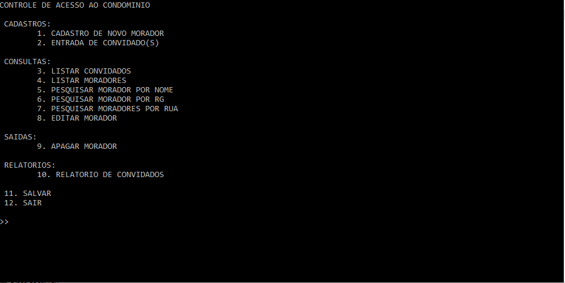

# Projeto Condominio
> Um sistema simples de controle de acesso a um condominio.

![NPM Version][npm-image]

O sistema foi criado como projeto acadêmico, para conclusão da matéria de C do curso Análise e Desenvolvimento de Sistemas na Faculdade de Tecnologia de Itu, turma do 2º Semestre de 2017.
O objetivo do sistema é controlar o acesso/entrada de moradores e convidados a um condominio.

## Contato

Erick Trettel de Almeida – ericktrettel@gmail.com

[https://github.com/erickTrettel/PROJETO_Condominio](https://github.com/erickTrettel/PROJETO_Condominio)

<!-- Markdown link & img dfn's -->
[npm-image]: https://img.shields.io/badge/version-1.0.0-blue.svg